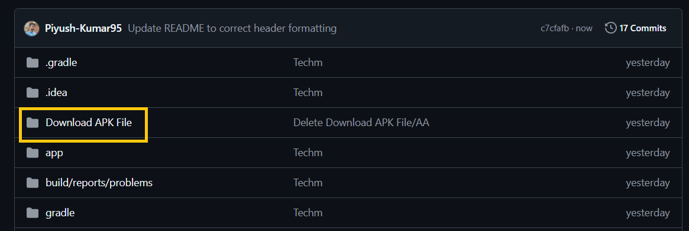

# TechMessenger – Chat Application (Android)
TechMessenger is a modern Android-based chat application designed to provide seamless and real-time communication between users. The app allows users to send and receive messages instantly with a simple and user-friendly interface.

The application is developed using Android development technologies and focuses on delivering a smooth messaging experience with efficient data handling and secure communication.

# Key Features:
- Real-time messaging between users
- User authentication and account management
- Clean and responsive Android UI
- Message storage and retrieval using backend/database integration
- Secure and efficient communication system

# Technologies Used: 
- Java (Android Development)
- Android Studio
- Firebase / Backend Database (if used)
- XML for UI Design
- Git & GitHub for version control

# Purpose of the Project:
This project was developed to demonstrate practical skills in Android application development, real-time communication systems, and mobile UI design.

### Users can download and install the APK file to experience the TechMessenger chat application on their Android devices.

